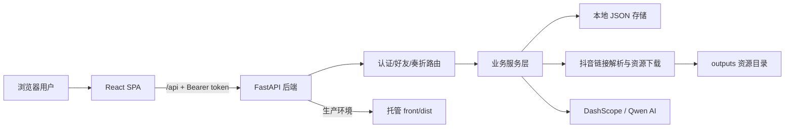
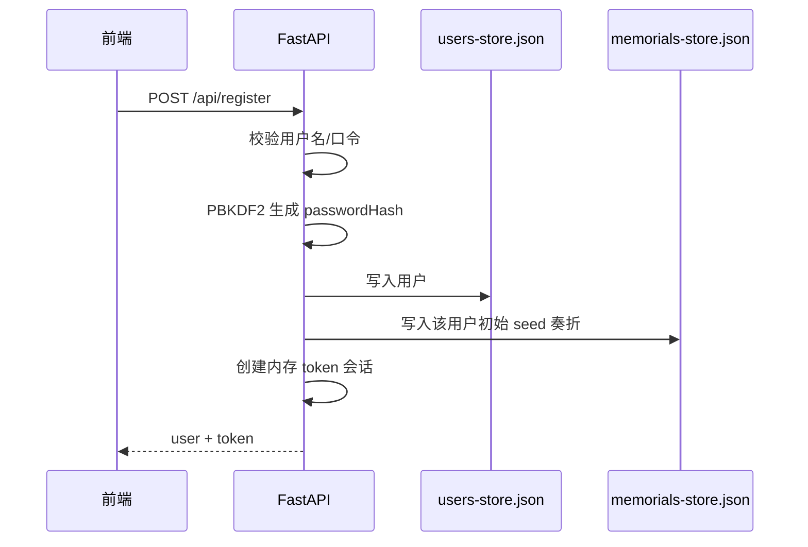
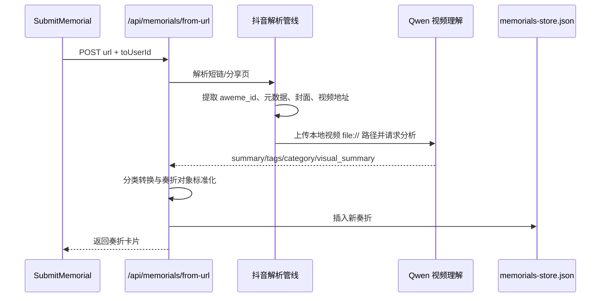

# 批阅奏折项目技术方案

## 1. 项目定位

本项目是一个“皇宫御书房”风格的短视频趣味批阅 Web 应用。用户粘贴抖音分享文案或视频链接后，系统解析视频内容并生成一封“奏折”卡片；用户可以对奏折进行准奏、驳回、留中、文字朱批和语音朱批，也可以通过好友体系互相递折，并查看每日简报与个人批阅画像。

项目采用前后端分离开发、后端统一托管生产静态资源的轻量全栈方案，适合 Hackathon、演示型应用和小规模部署。

## 2. 技术栈

| 层级 | 技术/依赖 | 说明 |
| --- | --- | --- |
| 前端 | React 19、TypeScript、Vite 6 | 单页应用、组件化开发、本地开发代理 |
| 样式与交互 | Tailwind CSS 4、lucide-react、motion | 古风卷轴 UI、图标按钮、弹窗与列表动画 |
| 后端 | FastAPI、Pydantic、Uvicorn | REST API、请求校验、CORS、异常包装 |
| AI 能力 | DashScope SDK、Qwen 文本/视频模型 | 文本奏折生成、视频理解、简报和画像生成 |
| 持久化 | 本地 JSON 文件 | `memorials-store.json`、`users-store.json`、`friends-store.json` |
| 视频处理 | Python 标准库 HTTP 能力 + 抖音页面解析 | 短链解析、元数据提取、视频/封面下载 |
| 部署 | FastAPI 静态托管 `front/dist` | 单端口部署，可接 Cloudflare Tunnel |

## 3. 总体架构



运行时分为两种模式：

- 开发模式：前端通过 `npm run dev` 运行在 `http://localhost:3000`，Vite 将 `/api` 与 `/health` 代理到 `http://127.0.0.1:8000`。
- 部署模式：先构建前端 `npm run build`，再由 FastAPI 直接托管 `front/dist`，外部只需要访问后端端口。

## 4. 目录分工

```text
.
├── app.py                         # FastAPI 入口，导出 backend.main:app
├── backend/
│   ├── main.py                    # 应用创建、CORS、异常处理、SPA 静态托管
│   ├── models.py                  # Pydantic 请求体与业务模型
│   ├── store.py                   # JSON 文件读写
│   ├── config.py                  # 路径与默认常量
│   ├── routers/                   # auth / friends / memorials API
│   ├── services/                  # 认证、奏折生成、AI 文本服务
│   └── video/                     # 抖音资源解析与 Qwen 视频分析
├── front/
│   ├── src/
│   │   ├── App.tsx                # 前端入口壳层
│   │   ├── context/AuthContext.tsx# 登录态管理
│   │   ├── utils/api.ts           # authFetch 与 token 管理
│   │   └── components/            # 工作台、详情、提交、好友、画像、简报组件
│   └── vite.config.ts             # Vite 配置与后端代理
├── memorials-store.json           # 奏折数据
├── users-store.json               # 用户数据
├── friends-store.json             # 好友关系数据
└── outputs/                       # 视频解析、封面、AI 分析、语音朱批等输出
```

## 5. 前端方案

前端是 React + TypeScript 单页应用，核心入口为 `front/src/App.tsx`。`AuthProvider` 负责启动时读取 `localStorage` 中的 `imperial-token`，调用 `/api/me` 恢复登录态；未登录显示 `LoginPage`，已登录进入 `Dashboard`。

主要组件职责如下：

| 组件 | 职责 |
| --- | --- |
| `Dashboard.tsx` | 主工作台，加载收到/发出的奏折、统计指标、栏目切换、搜索筛选、弹窗调度 |
| `SubmitMemorial.tsx` | 粘贴抖音链接，选择递折对象，自留或发送给好友 |
| `MemorialDetail.tsx` | 展示奏折详情，支持文字朱批、录音、状态决断和语音回放 |
| `BriefingView.tsx` | 拉取每日简报，展示分类统计和待批快捷入口 |
| `FriendsPanel.tsx` | 搜索用户、发送好友申请、处理收到/发出的申请 |
| `ProfilePanel.tsx` | 展示用户画像、批阅统计、AI 史官评语 |

前端请求统一通过 `authFetch` 封装：

- 默认添加 `Content-Type: application/json`。
- 若请求体为 `FormData`，保留浏览器自动生成的 multipart boundary。
- 自动从 `localStorage` 读取 token，并写入 `Authorization: Bearer <token>`。

## 6. 后端方案

后端使用 FastAPI 分层组织：

- `backend/main.py` 创建应用、配置 CORS、注册统一异常处理器、挂载业务路由，并在生产环境托管前端静态文件。
- `backend/routers/auth.py` 提供注册、登录、当前用户接口。
- `backend/routers/friends.py` 提供用户搜索、好友申请、好友列表和申请处理接口。
- `backend/routers/memorials.py` 提供奏折列表、创建、批阅、删除、重置、简报、画像、语音朱批等接口。
- `backend/services/memorials.py` 承载奏折创建、AI 结果转换、数据聚合、视频处理降级等核心业务逻辑。
- `backend/services/text_ai.py` 封装 DashScope 文本模型调用和 JSON 提取。
- `backend/video/` 负责抖音短链解析、资源下载和 Qwen 视频理解。

接口响应采用统一包装：

```json
{ "success": true, "data": {} }
```

失败响应：

```json
{ "success": false, "error": "错误信息" }
```

## 7. 核心业务流程

### 7.1 注册与登录



密码使用 `pbkdf2_sha256` 加盐哈希保存。登录 token 由后端保存在进程内 `sessions` 字典中，前端存储在 `localStorage` 的 `imperial-token`。这种方案实现简单，但服务重启后 token 会失效，适合演示型部署。

### 7.2 抖音视频生成奏折

前端当前提交入口固定走视频解析链：



处理细节：

- `extract_first_url` 从输入文本中提取第一个 URL。
- 抖音短链会被打开并追踪跳转，最终从分享页或页面脚本中解析 `aweme_id`。
- 后端读取分享页中的 `_ROUTER_DATA`，提取标题、作者、统计数据、封面、视频候选地址。
- 视频、封面和元数据写入 `outputs/`。
- Qwen 视频模型返回严格 JSON，包括 `summary`、`tags`、`category` 和可选 `visual_summary`。
- AI 分类会映射为前端分类：

| AI 分类 | 前端分类 |
| --- | --- |
| `干货类` | `经略阁` |
| `创意类` | `创意坊` |
| `抽象类` | `寻乐记` |

若抖音解析、视频下载、DashScope 调用或 AI JSON 校验失败，后端会使用 `fallback_analysis` 生成本地模板奏折，保证用户流程不中断。

### 7.3 批阅与语音朱批

奏折详情页支持三类决断：

- `approved`：准奏。
- `rejected`：驳回。
- `held`：留中。

文字朱批通过 JSON 请求提交；带语音时前端使用 `MediaRecorder` 录音，最长 30 秒，以 `multipart/form-data` 上传到 `/api/memorials/{memorial_id}/approve`。后端将音频保存到 `outputs/voice_comments/`，并在奏折数据中记录：

- `voiceCommentPath`
- `voiceCommentMime`
- `voiceCommentDurationMs`

发件人查看已发折件时，若对方已批阅，前端会调用 `/api/memorials/{memorial_id}/mark-read` 标记已读。

### 7.4 简报与画像

简报接口 `/api/briefing` 基于当前用户收到的奏折生成：

- 今日整体状态。
- 内阁奏报正文。
- 分类数量与平均娱乐指数。
- 活跃递折人。

画像接口 `/api/profile` 基于批阅历史统计：

- 收折总数、已批阅数。
- 准奏率、驳回率、留中率。
- 偏好分类、平均娱乐指数。
- AI 或本地模板生成的史官人物志。

## 8. 数据模型与持久化

项目使用本地 JSON 数组作为轻量持久化层，不依赖数据库。读写逻辑集中在 `backend/store.py`：

- `load_json(path)`：读取并校验顶层必须为数组。
- `save_json(path, data)`：以 UTF-8 和缩进格式写回。

核心文件：

| 文件 | 内容 |
| --- | --- |
| `users-store.json` | 用户账号、密码哈希、展示名、头像头衔 |
| `friends-store.json` | 好友申请、申请状态、双方用户 ID |
| `memorials-store.json` | 奏折内容、状态、朱批、收发双方、语音信息、视频信息 |

奏折对象主要字段：

| 字段 | 说明 |
| --- | --- |
| `id` | 奏折 ID |
| `title` / `summary` / `keywords` | AI 或模板生成的卡片内容 |
| `url` / `rawText` | 原始抖音链接与提交文本 |
| `category` | `经略阁`、`寻乐记`、`创意坊` |
| `status` | `pending`、`approved`、`rejected`、`held` |
| `fromUserId` / `toUserId` | 递折人与收折人 |
| `imperialComment` / `approvedTime` | 朱批与批阅时间 |
| `senderReadAt` | 发件人是否已查看对方批复 |
| `voiceComment*` | 语音朱批文件及元信息 |
| `videoInfo` | 视频标题、作者、封面、时长、点赞/评论/分享数 |

## 9. API 概览

| 模块 | 接口 |
| --- | --- |
| 系统 | `GET /health` |
| 认证 | `POST /api/register`、`POST /api/login`、`GET /api/me` |
| 好友 | `GET /api/users/search`、`GET /api/friends`、`POST /api/friends/request`、`POST /api/friends/{friend_id}/accept`、`POST /api/friends/{friend_id}/reject` |
| 奏折 | `GET /api/memorials`、`GET /api/memorials/sent`、`GET /api/memorials/{id}`、`POST /api/memorials`、`POST /api/memorials/from-url`、`POST /api/memorials/analyze`、`POST /api/memorials/analyzed` |
| 批阅 | `PATCH /api/memorials/{id}`、`POST /api/memorials/{id}/approve`、`POST /api/memorials/{id}/mark-read`、`GET /api/memorials/{id}/voice-comment` |
| 辅助 | `DELETE /api/memorials/{id}`、`POST /api/memorials/reset`、`GET /api/briefing`、`GET /api/profile` |

注意：`POST /api/generate-comment` 当前返回 410，表示 AI 朱批已禁用，前端改为手写或语音输入。

## 10. 配置与运行

后端依赖：

```bash
pip install -r requirements.txt
```

前端依赖与构建：

```bash
cd front
npm install
npm run build
```

启动后端：

```bash
uvicorn app:app --reload --port 8000
```

开发模式可单独启动前端：

```bash
cd front
npm run dev
```

AI 相关环境变量：

| 变量 | 说明 |
| --- | --- |
| `DASHSCOPE_API_KEY` | DashScope API Key，文本与视频 AI 均依赖 |
| `DASHSCOPE_TEXT_MODEL` | 可选，默认文本模型为 `qwen-plus` |
| `DASHSCOPE_MEMORIAL_TEXT_MODEL` | 可选，覆盖奏折文本生成模型 |
| `DASHSCOPE_BRIEFING_MODEL` | 可选，覆盖简报生成模型 |
| `DASHSCOPE_PROFILE_MODEL` | 可选，覆盖画像生成模型 |
| `DASHSCOPE_MODEL` | 可选，视频理解默认模型为 `qwen3.6-flash` |

未配置 `DASHSCOPE_API_KEY` 时，文本 AI 会跳过并使用本地模板；视频链路会在捕获异常后降级为模板奏折。

## 11. 可靠性与边界

当前实现优点：

- 架构轻量，前后端职责清晰，适合快速演示。
- AI 能力有本地模板降级，核心提交流程不依赖模型必然成功。
- Pydantic 对请求体和奏折对象做基础类型校验。
- 后端统一异常包装，前端能用一致的 `success/error` 结构处理错误。
- 生产环境可由后端单端口托管 SPA，部署简单。

当前限制：

- token 会话保存在内存中，后端重启后登录态失效。
- JSON 文件没有并发写锁，多用户高并发写入时可能出现覆盖风险。
- 删除和部分查询接口未严格校验奏折所有权，正式环境需要补充权限边界。
- 抖音页面结构变化、反爬策略或网络限制会影响视频解析成功率。
- 语音文件路径直接记录在 JSON 中，迁移部署时需要同步 `outputs/voice_comments/`。
- 前端 `.env.example` 中仍保留旧的 OpenAI-Compatible 配置说明，实际后端当前使用 DashScope 环境变量。

## 12. 后续演进建议

短期可优化：

- 增加后端测试，覆盖注册登录、好友申请、奏折创建、批阅、权限校验。
- 为 JSON 存储增加文件锁，或替换为 SQLite。
- 统一接口权限，确保用户只能读取和修改自己相关的奏折。
- 更新前端 `.env.example`，与实际 DashScope 配置保持一致。
- 为视频解析链路增加更清晰的错误码和前端提示。

中长期可演进：

- 将认证升级为 JWT 或服务端持久化 session。
- 将本地 JSON 迁移到关系型数据库，支持索引、分页和审计。
- 将抖音解析与视频 AI 处理拆为异步任务队列，前端轮询任务状态。
- 将语音朱批、封面、视频资源迁移到对象存储。
- 引入角色与权限模型，支持团队、公开广场、排行榜等多人玩法。
